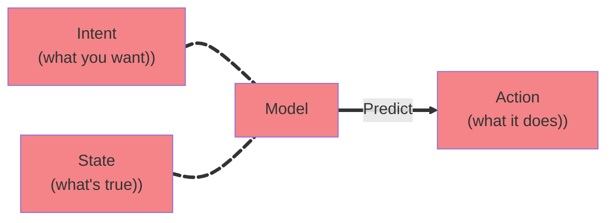

Chapter #2:
# Prompting basics

---
layout: default
---
# What you’ll learn

- How to provide context in Cursor
- How to choose a model
- Recommended practices
- Tips for building your prompts

---
layout: default
---

# Providing context



<!-- 
- Prompting has a few specifics in Cursor compared to e.g. ChatGPT
- when writing a prompt, we want to provide context to the model
  - so for example, if we want to write a test, it is good to disclose what kind of intention we have with the test, what is the goal of the test and so on
- thanks to the fact that we are working inside an IDE, it will provide some of that context automatically
- this is something that is good to have in mind, because it can be either a good thing or a bad thing
  - let’s say that you are vague in your intentions and your prompt says "write a test that adds an item to the list"
  - AI is going to start thinking: what kind of item, which list do you want me to test, should I write some edge cases? should I add assertions or not? it will try to add some context itself
  - same goes for state - should I write it to the active file or should I create a new one? what is the base URL? should I use page object model? I should probably think about the selectors that we use in this app 

-->

---
layout: center
---

# Demo

<!--
## #1 Show adding context
- add a #code reference to the test
  - good for refactoring or focusing on a very particular issue
> Note: reference `playwright.config.ts`
- add a file reference 
  - good for providing additional context, but bear in mind that we are also adding something stuff that is irrelevant (worker information etc.)
- add a folder reference
  - we are referencing all files, so when we use @tests - all the test files are going to get added to the context window - in my experience, you can just reference a folder name if you want to e.g. create a bunch of spec files in a particular folder
- Cursor indicates the percentage of context used

- the number indicates number of tokens - Tokens are the inputs and outputs of LLM models. They are chunks of text, often a fragment of a word, that an LLM processes one-by-one.
- https://www.vellum.ai/llm-leaderboard - context window comparison

## #2 Show switching models
- by default, Cursor will be set to "auto" - it has a logic to decide which model to choose for a given task
- the auto mode is also safest when it comes to cost savings
- once you choose a model yourself, you can run into limits much faster
- Cursor has been criticized for not having e aver transparent pricing model, basically it’s - leave it to us, or pay a lot of money
- personally, auto mode works decently well, sometimes I switch to Claude Sonnet 4o which is pretty good at coding
- I don’t like to experiment with models too much, they seem to have a sort of a "dialect", almost as if you need to talk to each model in a slightly different way

[Go back to slides]
-->

---
layout: default
---

# Prompt engineering

<v-clicks>

- beware of using someone else’s prompts
- build your own intuition
- reverse-engineer what worked
- read the docs

</v-clicks>

<!--
## #3 Prompting
- Prompting is a bit of an alchemy 
[click]
- there are endless posts on reddit and linkedin claiming they have found some magic prompt that doesn’t create any bugs or makes AI behave super reliably, they are all lies
[click]
- It is hard to find a good set of rules for prompting, my suggestion is to not rely on someone else’s prompt, but build your own intuition for what works and what doesn’t
[click]
- try to come back to what worked and reverse-engineer things that worked
[click]
- however - there are some good practices and you can find them on Anthropic or openAI docs, I’v inlcuded them in materials
-->

---
layout: default
---

# Anthropic & OpenAI & Google
some recommendations from their docs:

- Be explicit
- Add context
- Use positive examples
- Use Markdown or XML
- Utilize thinking, parallelism and eagerness

<!-- 
- so instead of saying "write a test for board" - say "write a test that opens the main page, and creates a new board by typing into the input"
- add context - you can add a motivation behind your instruction, so for tests you may want to tell Cursor that you want a certain functionality to work, or avoid a certain bug from happening
- it is much better to tell AI what to do rather than what not to do, because if you think about it, the whole example of what you don’t want is now taking space in the context window and you really want to be mindful of what you have there
- Markdown and XML help structure the format of your prompt, it helps to identify what’s what in your prompt
- this is bit more on the advanced side and is useful a bit later once you build a good intuition around prompting - but you can to stuff like - check the result of your work, research stuff in parallel, if the results of your research get too fuzzy, run one refined parallel batch then proceed - these are not usually things you would necessarily use in test automation, or at least not in the simpler projects, but it’s good to know about
-->

---
layout: default
---

# My presonal tips

- Embrace learning mindset
- Use single agent tab for single task
- Comments can guide AI
- Instruct AI to come up with multiple solutions and pick the best one
- Tell AI to add logs
- Use git commits religiously
- Restore checkpoints

<!-- 
- embrace learning mindset - don’t try to make the prompting process perfect, but iterate and learn
- use single agent tab for single task - the context window indicator is a good thing to follow, but you can also tell when AI gets stuck in a loop. even when debugging a problem, you can open a couple of agent tabs
- comments annotate not just for your colleagues but for AI too. especially if you do something "weird" or specific to your testing situation, comments can prevent AI from deleting or changing the code you actually need
- when using AI to solve a problem and you are not sure about the root cause, then tell AI to come up with multiple solutions and then either you pick the one that’s most probable, or let AI choose an option - by default, AI will try to converge to a single solution, but if you tell it not to, you’ll get a bigger variety of options
- another tip is to tell AI to add console logs, sometimes even add console logs to every line of code, especially when you have sync and async code, great for debugging race conditions
- AI can generate a lot of code, so make sure you don’t create PRs that have thousands lines of code in them. commit often
- restoring checkpoints is really useful, you can go back in a chat conversation and restore the code you had before. instead of telling AI to do that, just use Cursor
 -->


---
layout: center
---

# Demo
(again)

<!--

So let’s take some of these principles into practice and try to write a prompt that will generate some spec files that we will later fill with tests.

### Prompt to create tests:
```
inside the "tests" folder, create a "features" folder that will contain several spec files.

all spec file names are part of finished examples project as specified in @playwright.config.ts 

Each spec file will contain a single empty test for a given feature.

## Features
- board
- list
- card
- card detail
- login
- signup

## Example
an example of such file can be found in @02_prompting_basics.example.spec.ts 
```

### Repomix + Gemini

Repomix is a very handy tool that can pack your codebase into an AI-friendly format. It’s like a summary of your repository that you can put into your context window.

It has a VS Code plugin, so you can take part of your code.

What I usually do is that I pack my code and then put it into Gemini. The reason for that is that I don’t really want to use Cursor’s auto mode, and I want to avoid Cursor adding stuff in the background. Usually I use Gemini to do some sort of planning for me.

**Generate tests prompt**
```
Write an instruction for an A.I. code assistant.

The code assistant will be tasked with writing playwright tests for following features
- board
- list
- card
- card detail
- login
- signup

The code assistant will write e2e testing scenarios for the application referred in the codebase. It will use data-testid attributes as selectors, making use of the getByTestId method.

Use your thinking capabilities to get an understanding of the application logic.

There are already spec files ready to be filled with code, in the `playground/tests/features` folder with names in the format of <feature>.final.spec.ts

The data is removed before the test run, but you can send a request to /api/reset at any time to test run.
```

### Generate test cases prompt:
Another cool thing I can do is that I can generate test cases. For this I usually add some screenshots as well.

I then copy the Gemini output to markdown and use it in cursor to generate my tests

```
Create e2e test cases for this codebase. Test cases should cover happy paths. 
```

### Generate mermaid diagrams
**Prompt:**
```
Create a nernaud diagram of the user flows in this codebase
```
--> 
